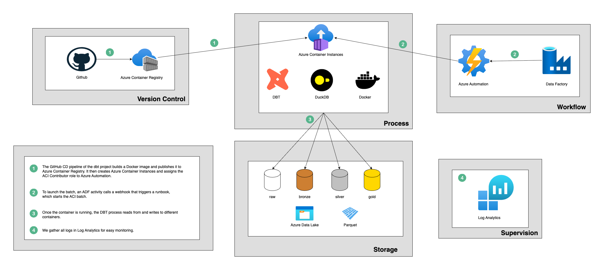

# duckdb-dbt-azure-infra

This repository contains the Terraform configuration associated with the [duckdb_dbt_azure](https://github.com/VictorMeyer77/duckdb_dbt_azure) project — a template for implementing batch processing pipelines using DBT and DuckDB on Microsoft Azure.

## Architecture

The Azure Resource Group provisioned by this Terraform setup follows the architecture below

